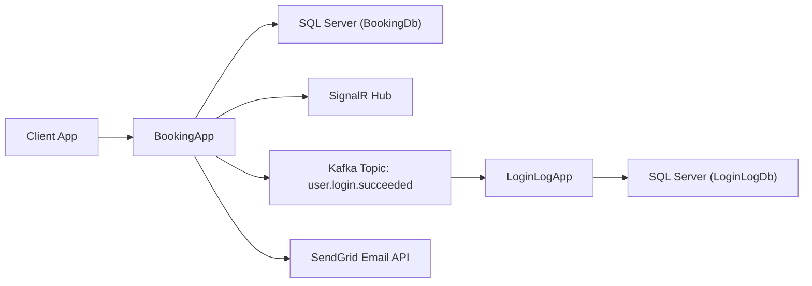

# Booking API

A layered ASP.NET Core backend for property booking, user management, reviews, admin moderation, real-time booking updates, and Kafka-based login event logging.

This repository contains two backends in one codebase:

- `BookingApp`: the main booking platform API
- `LoginLogApp`: a minimal event-consumer backend that stores successful login logs

## Highlights

- Clean layered architecture with separate app, application, domain, and infrastructure projects
- JWT authentication and role-based authorization
- Property search with filtering, availability checks, ratings, and pagination
- Booking lifecycle management with status transitions
- Review system tied to completed bookings
- Admin endpoints for user, property, and booking oversight
- SignalR for real-time booking status notifications
- Kafka event publishing for successful login events
- Dedicated login-log backend consuming Kafka and persisting events
- Integration tests for major user-facing flows
- Docker Compose setup for the full local stack

## Tech Stack

| Area | Technology |
|---|---|
| Runtime | .NET 10 / ASP.NET Core Minimal APIs |
| Architecture | Layered architecture, CQRS-style handlers |
| Application orchestration | MediatR |
| Validation | FluentValidation |
| Database ORM | Entity Framework Core |
| Main database | SQL Server |
| Test database | SQLite in-memory |
| Authentication | JWT Bearer |
| Password hashing | BCrypt |
| Real-time updates | SignalR |
| Messaging | Apache Kafka + Confluent.Kafka |
| Email delivery | SendGrid |
| API docs | Swagger / Swashbuckle |
| Testing | xUnit + ASP.NET Core integration testing |
| Containerization | Docker + Docker Compose |

## Architecture



### Main API flow

- `BookingApp` handles users, properties, bookings, reviews, admin features, SignalR notifications, and login event publishing.
- `LoginLogApp` listens to Kafka and stores successful login events in a separate database.

### Layer breakdown

- `BookingApp`
  HTTP entry point, endpoint mapping, middleware, SignalR hub
- `BookingApplication`
  commands, queries, handlers, DTOs, abstractions
- `BookingDomain`
  entities, enums, repository contracts
- `BookingInfrastructure`
  EF Core, auth, repositories, email sender, Kafka producer
- `LoginLogContracts`
  shared message contract between producer and consumer
- `LoginLogInfrastructure`
  EF Core log storage and Kafka consumer
- `LoginLogApp`
  minimal host for health endpoints and background consumption

## Repository Structure

```text
BookingApi/
├── BookingApp/
├── BookingApplication/
├── BookingDomain/
├── BookingInfrastructure/
├── BookingApp.IntegrationTests/
├── LoginLogApp/
├── LoginLogInfrastructure/
├── LoginLogContracts/
├── LoginLogApp.Tests/
├── docker-compose.yml
└── BookingApi.sln
```

## Core Features

### User Management

- Register and log in with JWT
- Update profile information
- Change password
- Role-aware authorization support

### Property Management

- Create and update properties as an owner
- Store property image URLs as an array of links
- Search properties by city, country, zip code, property type, guest count, amenities, price range, rating, and availability dates
- Search supports pagination and sorting

### Booking System

- Create bookings as a client
- Supports status transitions: `Pending`, `Confirmed`, `Rejected`, `Cancelled`, `Completed`, `Expired`
- Automatic SignalR notification payloads after successful status changes
- Booking status email notifications through SendGrid

### Reviews

- Reviews are tied to bookings
- Average rating is calculated per property
- Property details expose rating aggregates and recent reviews

### Admin Management

- View users
- Suspend or delete users
- View properties
- Approve, reject, or suspend properties
- View all bookings

## Real-Time Notifications with SignalR

SignalR is used for booking status updates.

- Hub endpoint: `/hubs/booking`
- Auth: JWT Bearer
- User targeting: custom `IUserIdProvider` maps the `userId` claim to SignalR user identity
- Event pushed to clients: `BookingStatusChanged`

Current flow:

1. Client authenticates and gets a JWT
2. Client connects to `/hubs/booking?access_token=...`
3. A booking status changes successfully
4. Middleware sends a SignalR event to both guest and owner

## Login Logging with Kafka

Successful login events are published asynchronously from the main backend to Kafka and consumed by a second backend.

### Event flow

1. User logs in successfully through `BookingApp`
2. `BookingApp` publishes `user.login.succeeded`
3. Kafka stores and delivers the event
4. `LoginLogApp` consumes the event
5. `LoginLogApp` writes a row to `LoginLogDb`

### Why this design

- Decouples login from logging persistence
- Keeps login requests fast
- Prevents log-backend issues from breaking authentication
- Preserves an auditable event trail in a dedicated table

### Stored login log fields

- `EventId`
- `OccurredAtUtc`
- `ReceivedAtUtc`
- `EventType`
- `SourceApp`
- `UserId`
- `Email`
- `PayloadJson`

## API Surface

### Main route groups

- `/`
- `/health`
- `/v1/user`
- `/v1/property`
- `/v1/booking`
- `/v1/review`
- `/v1/admin`
- `/hubs/booking`

## Local Development

### Prerequisites

- .NET SDK 10
- Docker Desktop
- SQL Server access if running outside Docker

### Run with Docker Compose

This is the fastest way to run the full stack locally.

```bash
docker compose up --build
```

Services:

- `BookingApp` on `http://localhost:8080`
- `LoginLogApp` on `http://localhost:8081`
- SQL Server on `localhost:1433`
- Kafka on `localhost:9092`

Health checks:

```bash
curl http://localhost:8080/health
curl http://localhost:8081/health
curl http://localhost:8081/ready
```

### Environment variables

The compose file supports SendGrid values from `.env`.

Example `.env`:

```env
SENDGRID_API_KEY=your_sendgrid_api_key
SENDGRID_FROM_EMAIL=your_verified_sender@example.com
SENDGRID_FROM_NAME=BookingApi
```

## Email Notifications

Booking status notifications use SendGrid.

Required config:

- `SendGrid__ApiKey`
- `SendGrid__FromEmail`
- `SendGrid__FromName`

Important:

- the sender address should be verified in SendGrid
- status emails are only attempted after a successful booking status transition

## Database Notes

### Main booking database

Contains the business entities:

- users
- roles
- user-role mappings
- owner profiles
- addresses
- properties
- bookings
- reviews

### Login log database

Contains one table:

- `LoginLogs`

This table is dedicated to Kafka-consumed login events.

## Testing

The repository includes both integration tests and focused unit tests.

### Booking API integration tests

Coverage includes:

- user registration and login-related flows
- profile updates and password changes
- property creation, updates, details, and search
- booking creation and status transitions
- review creation and rating aggregation
- admin endpoints
- login-event publishing behavior

Run:

```bash
dotnet test BookingApp.IntegrationTests/BookingApp.IntegrationTests.csproj -m:1 /nodeReuse:false
```

### Login log backend tests

Coverage includes:

- valid login event persistence
- duplicate-event deduplication
- malformed payload rejection

Run:

```bash
dotnet test LoginLogApp.Tests/LoginLogApp.Tests.csproj -m:1 /nodeReuse:false
```

### Convenience script

```bash
./scripts/test-integration.sh
```

## Deployment Notes

For the current architecture, the fastest deployment approach is a single VM using Docker Compose.

Why:

- the repo already ships with a working multi-service compose file
- both backends, Kafka, and SQL Server can run together without refactoring
- this is ideal for demo, development, or small staging deployments

For a more production-oriented setup later, you could split:

- main API
- login-log backend
- Kafka
- SQL Server

into separately managed services.

## Design Goals

- Keep core business logic isolated from transport details
- Make authentication independent from logging persistence
- Support both synchronous APIs and asynchronous events
- Keep the local development story simple with Docker
- Provide real-time UX where it matters without overcomplicating the API

## Future Improvements

- refresh tokens and token revocation
- richer property moderation workflow
- dead-letter handling for Kafka consumer failures
- long-lived Kafka producer optimization
- explicit log DB migrations
- frontend client example for SignalR
- observability dashboards and structured tracing

## License

Add the license of your choice here.
